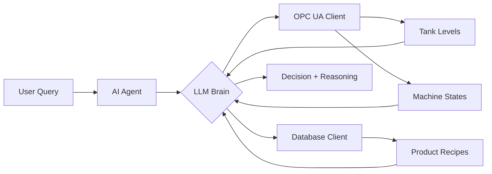

# 🏭 Industrial AI Agent for Batch Plant Production

Build an intelligent AI agent that automates production decisions in industrial batch plants using Python, LangChain, and OPC UA.

## 📺 Video Tutorial

This project is part of a comprehensive video tutorial series by Kudzai Manditereza on building agentic AI for industrial systems.

🎥 **[Watch the Tutorial: How to Build an Industrial AI Agent From Scratch](https://youtu.be/8CRXdrqPjgU)**

## 🎯 Overview

This project demonstrates how to build an AI-powered production assistant that can make intelligent decisions about batch production in industrial plants. Instead of manually checking raw materials, equipment status, and recipe requirements, this agent automates the entire decision-making process using natural language queries.

### The Problem
In traditional batch plant operations, operators must:
- Manually check raw material levels in storage tanks
- Verify the operational status of each machine
- Cross-reference product recipes with available materials
- Calculate if there are sufficient resources for production

### The Solution
An AI agent that:
- ✅ Connects to real-time industrial data via OPC UA
- ✅ Queries product recipes from a database
- ✅ Uses LLMs to orchestrate data gathering and decision-making
- ✅ Provides clear go/no-go decisions with detailed reasoning
- ✅ Responds to natural language queries

## ✨ Features

- **Natural Language Interface**: Ask questions like "Can we produce 3 batches of Product A?"
- **Real-time Data Integration**: Connects to OPC UA servers for live equipment and material data
- **Database Integration**: Retrieves product recipes from PostgreSQL/TimescaleDB
- **Intelligent Decision Making**: Uses Claude/GPT-4 to analyze data and make production recommendations
- **Structured Output**: Returns well-formatted JSON responses with clear reasoning
- **Tool Calling**: Leverages LangChain's tool-calling capabilities for seamless integration

## 🏗️ Architecture



### System Components

1. **Simulated Batch Plant Environment**
   - 3 storage tanks for raw materials
   - Mixer for combining materials
   - Reactor for chemical processing
   - Filler for packaging finished products

2. **Data Sources**
   - **OPC UA Server**: Real-time equipment data (tank levels, machine states)
   - **PostgreSQL Database**: Static data (products, recipes, raw materials)

3. **AI Agent Components**
   - **LLM**: Claude 3.5 Sonnet (or GPT-4/Local LLMs)
   - **Framework**: LangChain for tool orchestration
   - **Tools**: Python functions wrapped as LangChain tools

## 📋 Prerequisites

- Python 3.8 or higher
- PostgreSQL/TimescaleDB database
- OPC UA server (or simulation)
- API keys for LLM provider (Anthropic/OpenAI)

## 🚀 Installation

1. **Clone the repository**
```bash
git clone https://github.com/yourusername/industrial-ai-agent.git
cd industrial-ai-agent
```

2. **Create a virtual environment**
```bash
python -m venv venv
source venv/bin/activate  # On Windows: venv\Scripts\activate
```

3. **Install dependencies**
```bash
pip install -r requirements.txt
```

4. **Set up environment variables**
Create a `.env` file in the project root:
```env
# LLM API Keys
ANTHROPIC_API_KEY=your_anthropic_api_key
OPENAI_API_KEY=your_openai_api_key  # Optional

# Database Configuration
DB_USER=your_db_user
DB_PASSWORD=your_db_password
DB_HOST=localhost
DB_PORT=5432
```

### LLM Selection
In `main.py`, choose your preferred LLM:
```python
# Option 1: Claude
llm_anthropic = ChatAnthropic(model="claude-3-5-sonnet-20241022")

# Option 2: GPT-4
llm_openai = ChatOpenAI(model="gpt-4o")

# Option 3: Local LLM (e.g., Mistral)
llm_local = ChatOllama(model="mistral")
```

## 📖 Usage

### Running the AI Agent

```bash
python main.py
```

Example interaction:
```
What product and number of batches do you want to produce? Can we produce 3 batches of Product A?

==================================================
PRODUCTION ASSESSMENT RESULTS
==================================================

📊 DECISION: YES - You can produce 3 batches of Product A

🔍 REASONING:
For 3 batches of Product A you need:
- Material A: 300L (required) vs 8000L (available) ✓
- Material B: 600L (required) vs 13032L (available) ✓
- Material C: 450L (required) vs 18947L (available) ✓

All materials are sufficient and all machines are operational.

✅ Sufficient Materials: True

🏭 MACHINE STATES:
   🟢 mixer_state: running
   🟢 reactor_state: idle
   🟢 filler_state: running

🧪 MATERIAL AVAILABILITY:
   • tank1_material_level: 8,000.00 L
   • tank2_material_level: 13,032.00 L
   • tank3_material_level: 18,947.00 L

🔧 Tools Used: get_product_details, get_material_availability, get_machine_states
==================================================
```

### Testing Individual Components

**Test OPC UA connection:**
```bash
python batch_plant_functions.py
```

**Test database connection:**
```bash
python batch_plant_storage.py
```

## 📁 Project Structure

```
industrial-ai-agent/
├── batch_plant_functions.py  # OPC UA client implementation
├── batch_plant_storage.py    # Database interface for recipes
├── tools.py                  # LangChain tool wrappers
├── main.py                   # Main application and agent logic
├── requirements.txt          # Python dependencies
├── .env.example             # Environment variables template
└── README.md                # This file
```

### File Descriptions

- **`batch_plant_functions.py`**: Handles all OPC UA communication, reading tank levels and machine states
- **`batch_plant_storage.py`**: Manages database queries for product recipes and material requirements
- **`tools.py`**: Wraps Python functions as LangChain tools with proper descriptions
- **`main.py`**: Orchestrates the AI agent, including prompt engineering and response formatting

## 🔄 Workflow

1. **User Input**: Natural language query about production capability
2. **Recipe Retrieval**: Agent queries database for product recipe
3. **Material Check**: Agent reads current tank levels via OPC UA
4. **Equipment Check**: Agent verifies machine operational states
5. **Analysis**: LLM compares requirements vs. availability
6. **Decision**: Agent provides go/no-go decision with detailed reasoning


## 🤝 Contributing

Contributions are welcome! Please feel free to submit a Pull Request.

1. Fork the repository
2. Create your feature branch (`git checkout -b feature/AmazingFeature`)
3. Commit your changes (`git commit -m 'Add some AmazingFeature'`)
4. Push to the branch (`git push origin feature/AmazingFeature`)
5. Open a Pull Request

## 📝 License

This project is licensed under the MIT License - see the [LICENSE](LICENSE) file for details.

## 🙏 Acknowledgments

- **Kudzai Manditereza** - Tutorial creator and industrial AI expert
- **LangChain** - For the excellent agent framework
- **Anthropic/OpenAI** - For powerful LLM capabilities
- **AsyncUA** - For OPC UA client implementation

## 📧 Contact

For questions, suggestions, or collaboration opportunities:

- LinkedIn: [Your LinkedIn](https://www.linkedin.com/in/kudzaimanditereza/)
- YouTube: [Kudzai Manditereza](https://www.youtube.com/@industry40tvonline)


## 🔗 Links

- [Video Tutorial](https://www.youtube.com/@industry40tvonline)
- [LangChain Documentation](https://python.langchain.com/)
- [OPC UA Specification](https://opcfoundation.org/)
- [Anthropic Claude API](https://docs.anthropic.com/)

---

**⭐ If you find this project helpful, please consider giving it a star!**